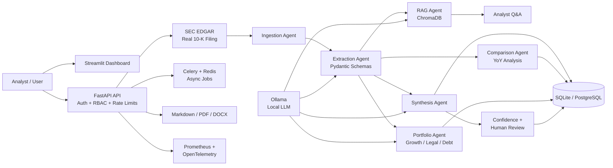

# Agentic Wealth Intelligence


A multi-agent system that automates 10-K financial risk analysis end to
end - ingestion, structured extraction, RAG-based Q&A, executive
synthesis, year-over-year comparison, and accuracy evaluation against
ground truth - exposed as an authenticated, role-gated, rate-limited REST
API with persistence, Redis-ready caching, an async job queue, Prometheus
metrics, OpenTelemetry tracing, downloadable reports, a real SEC EDGAR
integration, and a full interactive dashboard.

**Docker and Kubernetes are not required by the application, CI pipeline, or deployment architecture.** Everything runs as plain Python processes.

Built to demonstrate agentic orchestration (LangGraph), retrieval-augmented
generation (ChromaDB), schema-enforced LLM outputs (Pydantic), and the
production-engineering discipline (auth, RBAC, retries, caching, async
jobs, observability, CI quality gates) that separates a working demo
from a deployable service.

> **Data note:** The application supports real SEC EDGAR filings for live analysis. Synthetic filings are retained only as offline test fixtures and evaluation inputs; they are not presented as live investment data.


## Table of contents

- [Why this exists](#why-this-exists)
- [Architecture](#architecture)
- [Tech stack](#tech-stack)
- [Production-readiness features](#production-readiness-features)
- [CI/CD pipeline](#cicd-pipeline)
- [Design decisions](#design-decisions-worth-knowing)
- [Project structure](#project-structure)
- [Running it](#running-it)
- [API reference](#api-reference)
- [Dashboard](#dashboard)
- [Observability](#observability)
- [Test coverage](#test-coverage)
- [Feature status](#feature-status)
- [Deployment](#deployment)
- [Roadmap / honest limitations](#roadmap--honest-limitations)

## Why this exists

Manually reading a 10-K to extract revenue trends, covenant compliance,
and legal risk takes an analyst hours per filing - and tracking how those
signals shift across fiscal years takes even longer. This system
automates the first pass, tracks a company across time, measures its own
extraction accuracy against labeled ground truth, and exposes all of it
as a persisted, observable, role-gated service with real SEC data
integration and exportable output - not just a notebook or a CLI script.

## Responsible AI: human-in-the-loop approval + portfolio intelligence

Two features aimed specifically at what regulated-industry and
enterprise buyers actually ask for:

**Human-in-the-loop approval workflow.** Every synthesis report includes
a self-assessed confidence score. Reports at or above 90% confidence
(configurable) auto-approve; everything below is routed to a human
reviewer via `GET /reports/pending-review`, who approves or rejects it -
optionally editing the recommendation - via `POST /reports/{id}/review`.
Every reviewer decision is persisted as a `FeedbackRecord`: real labeled
data for future prompt/model improvement. This is **not** an online
learning loop - no weights update automatically - and that distinction
is documented explicitly rather than implied away (see
`docs/TECH_DECISIONS.md`).

**Multi-company portfolio intelligence.** Given multiple company filings, `PortfolioAgent` ranks companies by revenue growth, legal/regulatory risk, and debt exposure. Rankings are computed deterministically from extracted evidence for reproducibility and auditability, while the LLM is used for the sector-level narrative.
## Architecture



| # | Component | Responsibility |
|---|---|---|
| 1 | **Ingestion Agent** | Loads a filing (local or real SEC EDGAR via ticker), splits it into overlapping chunks |
| 2 | **Extraction Agent** | Returns a structured `ExtractionResult` - schema-enforced via Pydantic |
| 3 | **RAG Agent** | Embeds chunks into ChromaDB; answers ad-hoc analyst questions via retrieval |
| 4 | **Synthesis Agent** | Produces an executive risk memo with a self-assessed confidence score |
| 5 | **Comparison Agent** | Reasons across two fiscal years' extractions to produce a year-over-year trend report |
| 6 | **Evaluation Harness** | Scores an extraction against hand-labeled ground truth |
| 7 | **Approval Workflow** | Human-in-the-loop governance: confidence < 90% routes to a human reviewer instead of auto-approving |
| 8 | **Portfolio Agent** | Ranks multiple companies by growth, legal risk, and debt exposure - deterministic, auditable rankings + one LLM-generated narrative |
| 9 | **API layer** | Authenticated, role-gated, rate-limited FastAPI service with persistence, caching, tracing, and metrics |
| 10 | **Async job queue** | Celery + Redis - submit long-running analysis, poll for the result |
| 11 | **Report export** | Renders any persisted report as Markdown, PDF, or DOCX |
| 12 | **Dashboard** | Full Streamlit UI: analyze, compare, portfolio, pending review, evaluate, history, charts, KPIs, downloads |
| 13 | **Observability** | Prometheus metrics + Grafana dashboard + OpenTelemetry tracing |
| 14 | **Deployment** | `Procfile` + buildpack hosting (Render/Railway) - no Dockerfile in this repo |

Every LLM call is forced into a Pydantic schema (`src/schemas.py`) - a
malformed or hallucinated response fails validation instead of silently
corrupting downstream state.

## Tech stack

| Tool | Role | Why this one |
|---|---|---|
| **LangGraph** | Agent orchestration | Explicit, typed state passed between nodes - independently testable, unlike a single prompt |
| **LangChain** (`langchain-text-splitters`) | Document chunking | `RecursiveCharacterTextSplitter` for overlap-aware chunking |
| **ChromaDB** | Vector store (RAG) | Embedded, no external service required |
| **Pydantic / pydantic-settings** | Structured contracts + config | Forces LLM responses into validated schemas; typed, env-driven settings |
| **Ollama** | Local LLM | Local model inference for live financial analysis; mock mode remains available for offline tests |
| **requests** | Real SEC EDGAR client | Genuine HTTP calls to SEC's public APIs, tested via mocked responses |
| **FastAPI** | REST API | Async, Pydantic-native request/response validation, automatic OpenAPI docs |
| **tenacity** | Retry logic | Exponential backoff on transient LLM call failures |
| **slowapi** | Rate limiting | Per-client request throttling |
| **SQLAlchemy** | Persistence | SQLite by default, Postgres via one env var change |
| **cachetools / redis** | Caching | Pluggable backend: in-memory (default) or Redis (shared across instances) |
| **Celery + Redis** | Async job queue | Submit long-running analysis, poll for results, scale workers independently |
| **prometheus-client** | Metrics | `/metrics` endpoint - request and per-agent-stage latency |
| **OpenTelemetry** | Distributed tracing | Per-request spans across all four pipeline stages |
| **fpdf2 / python-docx** | Report export | Markdown/PDF/DOCX generation from the same report data |
| **Procfile + Honcho** | Local multi-process dev | Runs `web`/`worker`/`dashboard` processes from one terminal - no containers |
| **Render / Railway (buildpack)** | Cloud deployment | Auto-detects Python from `requirements.txt` + `Procfile`, builds without a Dockerfile |
| **ruff / black / bandit** | Code quality | Lint, format, and security scanning enforced in CI |
| **Streamlit / pandas** | Dashboard | Interactive UI with charts, KPIs, exports, and report history |
| **pytest / pytest-cov / fakeredis** | Testing | 156 tests, 94% coverage, fully offline via mocks (LLM, HTTP, Redis, Celery, Ollama) |
| **Locust** | Load testing | Real recorded runs against a live local server - see `loadtest/RESULTS.md` |

Full rationale, trade-offs, and honest limitations for each choice:
[`docs/TECH_DECISIONS.md`](docs/TECH_DECISIONS.md).

## Production-readiness features

- **Authentication + RBAC** - API-key based with three hierarchical
  roles (`viewer` < `analyst` < `admin`); checked with constant-time
  comparison
- **Rate limiting** - per-client-IP throttling via `slowapi`
- **Caching** - pluggable backend (`CACHE_BACKEND=memory|redis`);
  repeated `/analyze` calls with identical inputs return a cached
  result instead of recomputing
- **Async job queue** - `/analyze/async` submits to Celery, returns
  immediately with a task ID; `/tasks/{id}` polls for the result
- **Retry logic** - LLM calls retry up to 3x with exponential backoff
- **Structured logging** - JSON log lines with a per-request correlation ID
- **Metrics** - Prometheus `/metrics` endpoint: request count/latency
  and per-agent-stage execution time, visualized in a real Grafana
  dashboard (`monitoring/grafana/dashboards/awi-operations.json`)
- **Distributed tracing** - OpenTelemetry spans around each pipeline
  stage, exportable to a hosted collector via OTLP
- **Persistence** - every `/analyze`, `/compare`, and `/evaluate` call is
  saved to a database (list, fetch, export, and delete via API), plus an
  audit log. SQLite by default, Postgres via `DATABASE_URL`
- **Downloadable reports** - export any persisted report as Markdown,
  PDF, or DOCX
- **Real SEC EDGAR integration** - genuine (not synthetic) client for
  SEC's public APIs, tested via mocked HTTP responses
- **Health checks** - `/health` endpoint for load balancer / platform probes
- **Buildpack deployment, no Docker** - `Procfile` declares process
  types; Render/Railway build directly from `requirements.txt`
- **Configurable real embeddings** - `EMBEDDING_MODE=sentence_transformer`
  swaps the offline hashing placeholder for real semantic search

What's honestly still missing for full enterprise status - multi-tenant
identity management beyond API-key RBAC, production-scale load testing -
is listed in [`docs/TECH_DECISIONS.md`](docs/TECH_DECISIONS.md) rather
than glossed over.

## CI/CD pipeline

Every push runs, on Python 3.11 and 3.12:

1. **Lint** - `ruff check src/ tests/ app.py`
2. **Format check** - `black --check src/ tests/ app.py`
3. **Security scan** - `bandit -r src/`
4. **Tests + coverage** - `pytest --cov=src --cov-report=xml` (currently
   94%, 156 tests - including validation of every Grafana dashboard
   panel against real exported metrics)
5. **End-to-end CLI smoke tests** - runs the demo, YoY comparison, and
   evaluation scripts for real
6. Coverage report uploaded as a build artifact

A separate `deploy.yml` workflow template triggers a Render deploy after
tests pass - inactive until you add your own `RENDER_SERVICE_ID`/
`RENDER_API_KEY` secrets.

See [`.github/workflows/`](.github/workflows/).

## Design decisions worth knowing

- **Tests use mock/offline mode; live analysis uses real SEC EDGAR data and can use Ollama locally.** LLM calls, the SEC EDGAR client,
  Redis cache backend, and Celery task queue all have offline-testable
  mock paths - the entire system is tested without any external service
  running.
- **Real EDGAR client, mocked in CI.** `src/edgar_client.py` genuinely
  calls SEC's public APIs - tested via mocked HTTP responses. No real
  filing text ships in this repo.
- **SQLite by default, Postgres-ready.** One environment variable, no
  code change.
- **Cache backend is pluggable, not silently degraded.** In-memory by
  default; Redis when you need cache state shared across instances.
- **Async jobs use a real queue, not FastAPI BackgroundTasks.** Celery +
  Redis survives process restarts and scales workers independently.
- **Docker and Kubernetes are not required.** Deployment uses `Procfile` + a buildpack
  host (Render/Railway) instead - see `docs/TECH_DECISIONS.md` for why,
  including a very practical reason (Docker Desktop caused real machine
  instability during development).
- **Grafana dashboard only shows metrics this app actually exports.**
  A test fails if any panel ever references a metric that doesn't exist.
- **Synthetic sample filings.** Two fiscal years of a fictional company's
  10-K, internally consistent so the YoY comparison tells a coherent story.

## Project structure

```
agentic-wealth-intelligence/
||| .github/workflows/
|‚   ||| tests.yml                 # CI: lint, format, security scan, tests, coverage
|‚   |”|| deploy.yml                # CD template: deploys to Render after tests pass
||| monitoring/
|‚   ||| prometheus.yml            # Scrape config (usable with a native or hosted Prometheus)
|‚   |”|| grafana/
|‚       ||| dashboards/awi-operations.json
|‚       |”|| provisioning/         # Auto-configured datasource + dashboard
||| loadtest/
|‚   ||| locustfile.py             # Load test definitions
|‚   |”|| RESULTS.md                # Real recorded benchmark runs
||| src/
|‚   ||| config.py                 # Centralized, typed settings (env-driven)
|‚   ||| logging_config.py         # Structured JSON logging
|‚   ||| tracing.py                # OpenTelemetry span instrumentation
|‚   ||| metrics.py                # Prometheus metrics (HTTP + per-agent-stage)
|‚   ||| db.py                     # SQLAlchemy persistence (reports + audit log)
|‚   ||| cache.py                  # Pluggable cache backend (memory | Redis)
|‚   ||| tasks.py                  # Celery async job definitions
|‚   ||| edgar_client.py           # Real SEC EDGAR API client (mocked in tests)
|‚   ||| report_export.py          # Markdown / PDF / DOCX export
|‚   ||| approval_workflow.py      # Human-in-the-loop confidence-based routing
|‚   ||| portfolio_agent.py        # Cross-company growth/risk/debt ranking + narrative
|‚   ||| schemas.py                # Pydantic contracts for all agent/report outputs
|‚   ||| llm_client.py             # Gemini/Ollama wrapper, mock/live modes, retry logic
|‚   ||| ingestion_agent.py        # Load local filings + fetch real filings from EDGAR
|‚   ||| extraction_agent.py       # Structured risk extraction
|‚   ||| rag_agent.py              # ChromaDB indexing + retrieval + Q&A + embedding factory
|‚   ||| synthesis_agent.py        # Executive memo generation + confidence score
|‚   ||| comparison_agent.py       # Year-over-year trend synthesis
|‚   ||| evaluation.py             # Accuracy scoring against ground truth
|‚   ||| orchestrator.py           # LangGraph StateGraph + timing + tracing instrumentation
|‚   |”|| api/
|‚       ||| main.py               # FastAPI app: routes, middleware, RBAC, caching, DB, metrics
|‚       ||| auth.py               # API key auth + role-based access control
|‚       |”|| models.py             # Request/response schemas
||| tests/                        # 156 tests, all passing offline, 94% coverage
||| data/
|‚   ||| sample_filings/           # Synthetic FY2024 + FY2025 demo filings
|‚   |”|| ground_truth_labels.json  # Hand-labeled ground truth for evaluation
||| docs/
|‚   ||| TECH_DECISIONS.md         # Why each tool was chosen, trade-offs
|‚   ||| INTERVIEW_PREP.md         # Anticipated technical questions
|‚   |”|| DEPLOYMENT.md             # Step-by-step: GitHub -> local -> cloud (no Docker)
||| app.py                        # Streamlit dashboard
||| run_demo.py                   # CLI: single-filing pipeline
||| run_yoy_comparison.py         # CLI: year-over-year comparison
||| run_evaluation.py             # CLI: evaluation harness
||| run_portfolio_analysis.py     # CLI: multi-company portfolio ranking
||| Procfile                      # Process types for Honcho / Render / Railway
||| pyproject.toml                # ruff/black/pytest/bandit config
||| Makefile                      # make install/test/lint/demo/yoy/eval/app/api/worker/dev/loadtest
||| requirements.txt
|”|| LICENSE
```

## Running it

**Docker is not required for any of this.**

```bash
git clone https://github.com/Shraddhatodkari/agentic-wealth-intelligence.git
cd agentic-wealth-intelligence
pip install -r requirements.txt

python run_demo.py             # single-filing pipeline, mock mode, no API key needed
python run_yoy_comparison.py   # year-over-year comparison (FY2024 vs FY2025)
python run_evaluation.py       # evaluation harness, scored against ground truth
python run_portfolio_analysis.py  # ranks 3 companies by growth, legal risk, debt exposure
streamlit run app.py           # full dashboard at http://localhost:8501
uvicorn src.api.main:app --reload --port 8000   # REST API at http://localhost:8000/docs
pytest tests/ -v                # 156 tests, all pass with zero external services

# Run everything at once (Procfile + Honcho, still no Docker)
PORT=8000 honcho start -f Procfile
# or: make dev

# Load test (Locust is a plain pip package)
locust -f loadtest/locustfile.py --host http://localhost:8000 \
    --users 15 --spawn-rate 5 --run-time 20s --headless
# Real recorded results: loadtest/RESULTS.md

# Local LLM via Ollama instead of Gemini (no Docker, no API key, no cloud cost)
# Install Ollama natively from https://ollama.com, then:
export LLM_MODE=ollama
python run_demo.py

# Live local LLM mode via Ollama
# Start Ollama and ensure the configured model is available, then:
$env:LLM_MODE="ollama"
python run_demo.py

# Real SEC EDGAR fetch (requires network + SEC_USER_AGENT)
export SEC_USER_AGENT="Jane Doe jane@example.com"
python -c "from src.ingestion_agent import IngestionAgent; print(IngestionAgent().fetch_from_ticker('AAPL')[:500])"
```

`make` versions of the same commands (`make demo`, `make app`, `make api`,
`make test`, `make dev`) work identically if you have `make` installed.

### Optional: Redis-backed cache + async jobs (still no Docker)

Install Redis natively (e.g. via WSL on Windows, or a native build)
rather than through Docker:

```bash
export CACHE_BACKEND=redis
export CELERY_BROKER_URL=redis://localhost:6379/1
export CELERY_RESULT_BACKEND=redis://localhost:6379/2
celery -A src.tasks worker --loglevel=info    # separate terminal, or: make worker
```

## API reference

Interactive docs auto-generated at `/docs` once running (`make api`).

| Endpoint | Method | Min. role | Description |
|---|---|---|---|
| `/health` | GET | none | Liveness check |
| `/metrics` | GET | none | Prometheus scrape endpoint |
| `/analyze` | POST | analyst | Run the full single-filing pipeline; cached, persisted; returns `approval_status` |
| `/analyze/async` | POST | analyst | Submit as a background Celery job; returns a task ID |
| `/tasks/{task_id}` | GET | viewer | Poll async job status/result |
| `/ask` | POST | analyst | Ad-hoc Q&A against the last analyzed filing |
| `/compare` | POST | analyst | Year-over-year comparison between two filings |
| `/evaluate` | GET | analyst | Score sample extractions against ground truth |
| `/portfolio/analyze` | POST | analyst | Rank multiple companies by growth, legal risk, and debt exposure |
| `/reports` | GET | viewer | List persisted reports (audit trail) |
| `/reports/{id}` | GET | viewer | Fetch a single persisted report |
| `/reports/{id}/export` | GET | viewer | Export as `?format=md\|pdf\|docx` |
| `/reports/pending-review` | GET | analyst | Human reviewer's queue - reports below the confidence threshold |
| `/reports/{id}/review` | POST | analyst | Approve or reject a pending report, optionally editing the recommendation |
| `/reports/{id}` | DELETE | admin | Delete a persisted report |

```bash
curl -X POST http://localhost:8000/analyze \
  -H "Content-Type: application/json" \
  -H "X-API-Key: dev-local-key" \
  -d '{"company": "Apple Inc.", "fiscal_year": "FY2025"}'
```

Configure roles via `API_KEYS="key1:admin,key2:analyst,key3:viewer"`.
Requests without a valid key return `401`; requests below the required
role return `403`; requests exceeding the rate limit return `429`.

## Dashboard

`streamlit run app.py` launches the full interactive dashboard with executive KPIs and six core workflows:

- **Analyze** - live filing analysis with confidence and approval status
- **Compare Years** - year-over-year financial and risk trends
- **Portfolio** - cross-company growth, legal-risk, and debt analysis
- **Pending Review** - human approval and recommendation workflow
- **Evaluate** - extraction accuracy against labeled ground truth
- **Report History** - persisted reports, charts, Q&A, and Markdown/PDF/DOCX exports

All dashboard workflows use the same application services and persistence layer as the REST API.
## Observability

- **Metrics** - `/metrics` (Prometheus format): HTTP request rate/latency
  by endpoint and status code, plus per-agent-stage execution time
  (`awi_agent_stage_duration_seconds{stage="ingestion|extraction|rag_indexing|synthesis"}`)
- **Grafana dashboard** - `monitoring/grafana/dashboards/awi-operations.json`:
  request rate, error rate, API latency percentiles, agent stage latency,
  status code breakdown. Point a native or hosted Prometheus/Grafana
  (e.g. Grafana Cloud's free tier) at `/metrics` to use it - no Docker required
- **Tracing** - OpenTelemetry spans around every pipeline stage; console
  exporter by default, OTLP to a hosted collector via `OTEL_EXPORTER=otlp`

## Test coverage

```
$ pytest tests/ --cov=src --cov-report=term -q
156 passed
TOTAL coverage: 94%
```

The one notably lower-coverage file (`llm_client.py`, 83%) is mostly the
live Gemini/Ollama call paths - correctly untested in CI since real
external calls aren't made there.

## Feature status

Every item from the enterprise-upgrade roadmap, status as of this build:

| Feature | Status |
|---|---|
| SEC EDGAR live integration | **Code complete, verified against current SEC API docs.** Real client, tested via mocked HTTP responses. Not run against live SEC.gov from this sandboxed environment; run it yourself with `SEC_USER_AGENT` set |
| Local LLM via Ollama | **Done.** `LLM_MODE=ollama` - no Docker, no API key, no cloud cost |
| Streamlit dashboard with KPIs/charts | **Done.** Executive KPI bar + revenue charts + stage timing charts + portfolio charts across 6 tabs |
| Human-in-the-loop approval workflow | **Done, verified live end-to-end.** Confidence-based routing, reviewer queue, approve/reject with edits, feedback persistence |
| Multi-company portfolio intelligence | **Done, verified live.** Deterministic growth/risk/debt rankings across 3 companies + LLM-generated narrative |
| Cloud deployment | **Not deployed** - needs your own Render/Railway account. No Dockerfile needed; step-by-step guide: `docs/DEPLOYMENT.md` |
| CI (automated testing) | **Done.** Lint, format, security scan, tests, coverage - every push |
| CD (automated deployment) | **Template added** (`.github/workflows/deploy.yml`), inactive until you add your own Render secrets |
| Distributed tracing | **Instrumentation done**, visualization backend **not included** - point `OTEL_EXPORTER=otlp` at a hosted collector (e.g. Grafana Cloud Tempo) to see it rendered |
| Centralized logging | **Structured JSON logs done** (the input a log aggregator needs); aggregation itself not included - a hosted option (Grafana Cloud Loki) is the no-Docker path |
| Auth/RBAC | **Done.** API-key based, 3-tier role hierarchy (viewer/analyst/admin), not JWT |
| Persistent storage | **Done.** SQLite by default, Postgres via one env var; full report + audit history, plus reviewer feedback records |
| Load testing | **Completed with Locust.** A 15-concurrent-user local benchmark is recorded in `loadtest/RESULTS.md`, including a rate-limiter-triggered `429` finding |
| Docker/Kubernetes | **Deliberately not used.** See `docs/TECH_DECISIONS.md` for why - deployment uses `Procfile` + a buildpack host instead |

## Deployment

Full step-by-step guide, GitHub push through cloud hosting (Render/Railway,
no Docker): [`docs/DEPLOYMENT.md`](docs/DEPLOYMENT.md).

## Roadmap / honest limitations

- With multiple instances, `CACHE_BACKEND=redis` and a shared Postgres
  `DATABASE_URL` are required - the single-instance defaults are for
  local/demo use
- Real embeddings supported as a configuration toggle but not the default
- Evaluation harness checks count/key-field correctness, not full
  NLP-quality scoring
- Grafana dashboard covers HTTP + agent-stage metrics only - Redis cache
  hit rate and Celery queue depth would need additional exporters
- RBAC is API-key-based, not full multi-tenant identity management
- Load-tested at 15 concurrent users locally (see `loadtest/RESULTS.md`)
  - not tested at production-representative scale
- Trace/log visualization needs a hosted service (e.g. Grafana Cloud) -
  the instrumentation feeding it is real, the visualization backend
  isn't included, by choice, to avoid a Docker dependency
- Gemini support uses the `google.genai` client; Ollama remains the intended local inference mode

## License

MIT - see [LICENSE](LICENSE).
